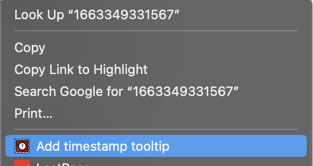
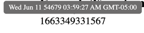
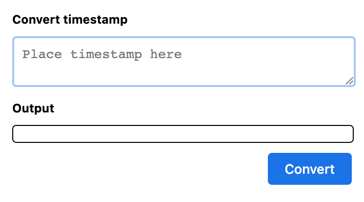

# Timestamp Tooltip

## Description
This extension converts the given timestamp into a more human-readable form, converting to your local timezone if possible.

## Usage
This extension can be used in one of 2 ways.

1. Highlighting a timestamp, right-clicking on it and clicking on 'Add timestamp tooltip'. This will replace the html element highlighted with the same text, but upon hovering over the text now, a tooltip will appear with the more human-readable timestamp.

2. In the extension menu (the puzzle piece icon in the upper right of a Chrome browser) click on the Timestamp Tooltip icon. This will bring up a popup window where you can paste any timestamp, click the "Convert" button. The resultant timestamp (if able to parse), will be posted in the "Output" box.

## Installation of Chrome extension

1. Open your Chrome browser and navigate to chrome://extensions. 
2. Enable Developer Mode by clicking the toggle switch next to Developer mode.
3. Click the Load unpacked button and select this directory
