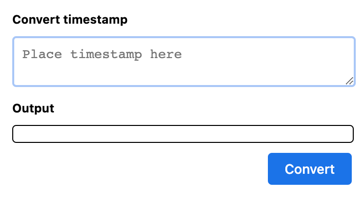

# Timestamp Tooltip

## Description
This extension converts the given timestamp into a more human-readable form, converting to your local timezone if possible.

## Timestamp Pattern Support
The following patterns are just some timestamp patterns supported:

Unix time:

e.g. 1663349331567

Typical timestamp formats:

| Timestamp format             | Example                   |
|------------------------------|---------------------------|
| MMM dd yyyy HH:mm:ss	        | Jun 09 2018 15:28:14      |
| yyyy-MM-dd'T'HH:mm:ss        | 2017-07-04T13:23:55       |
| MMM dd, yyyy hh:mm:ss a      | Dec 2, 2017 2:39:58 AM    |
| MMM dd HH:mm:ss ZZZZ         | Jul 18 21:45:12 GMT-0500  |
| yyyy-MM-dd'T'HH:mm:ss.SSS'Z' | 2017-07-01T14:59:55.711Z  |

## Usage
This extension can be used in one of 2 ways.

1. When a webpage loads, any timestamps that match the above format will be underlined and when hovered over, a tooltip will appear showing the converted timestamp in your local timezone.
2. In the extension menu (the puzzle piece icon in the upper right of a Chrome browser) click on the Timestamp Tooltip icon. This will bring up a popup window where you can paste any timestamp, click the "Convert" button. The resultant timestamp (if able to parse), will be posted in the "Output" box.

## Installation of Chrome extension

1. Open your Chrome browser and navigate to chrome://extensions. 
2. Enable Developer Mode by clicking the toggle switch next to Developer mode.
3. Click the Load unpacked button and select this directory
